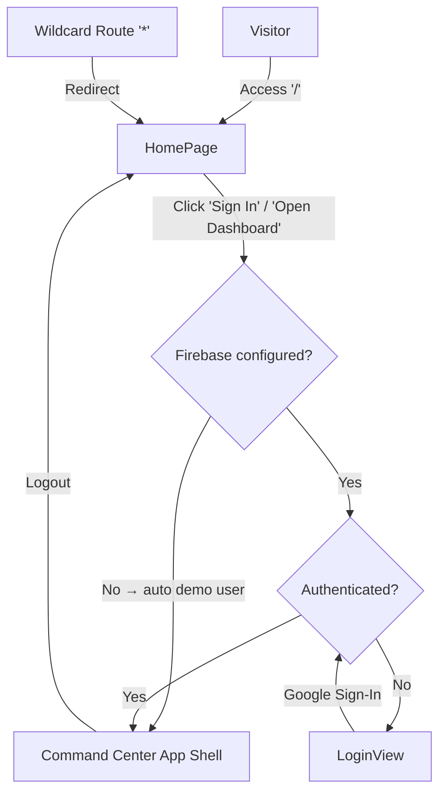

# LogiSight Homepage & Operational Flow Documentation

This document outlines the recent enhancements, component structure, design systems, and navigational flows implemented for the **LogiSight** public landing page (Homepage) and its integration with the core application.

---

## 1. Routing & User Flow

The application routing is managed by `react-router-dom` in [main.jsx](file:///home/jsren/Projects/technomancers-gdg/solv-v2-main/frontend/src/main.jsx). The navigation flow is split between a public informational interface and an operation command center. Authentication is handled via Firebase when configured, or falls back to an automatic demo user when it is not.

### Route Configurations
*   **Public Landing (`/`)**: Renders [HomePage.jsx](file:///home/jsren/Projects/technomancers-gdg/solv-v2-main/frontend/src/pages/HomePage.jsx).
*   **Sign In (`/login`)**: Renders [App.jsx](file:///home/jsren/Projects/technomancers-gdg/solv-v2-main/frontend/src/App.jsx). 
*   **Dashboard (`/dashboard`)**: Renders [App.jsx](file:///home/jsren/Projects/technomancers-gdg/solv-v2-main/frontend/src/App.jsx).
*   **Fallback (`*`)**: Redirects all unrecognized paths back to `/`.

### Authentication & Redirect Guard Flow
Auth guard logic resides in [App.jsx](file:///home/jsren/Projects/technomancers-gdg/solv-v2-main/frontend/src/App.jsx#L309-L337):

#### Firebase / Demo Mode
Firebase configuration is loaded from environment variables (`VITE_FIREBASE_*`). When valid Firebase credentials are present, real Google Auth runs. When they are absent (the default for dev), [firebase.js](file:///home/jsren/Projects/technomancers-gdg/solv-v2-main/frontend/src/firebase.js) falls back to an automatic **Demo User** (`uid: "demo"`, `displayName: "Demo User"`), bypassing the login screen entirely.

This allows the full dashboard to work without any Firebase project setup.

#### Flow Rules
1.  **No Firebase config**: `onAuthChange` immediately returns `DEMO_USER` → user is "authenticated" → app renders the Command Center directly.
2.  **Firebase configured, unauthenticated**: Redirected from `/dashboard` → `/login`.
3.  **Firebase configured, authenticated**: Redirected from `/login` → `/dashboard`.
4.  **Logout**: Resets auth state and redirects to `/`. In demo mode, logout is a no-op — the user remains `DEMO_USER`.

---

## 2. Homepage Architecture & Components

The homepage components reside in [frontend/src/components/homepage/](file:///home/jsren/Projects/technomancers-gdg/solv-v2-main/frontend/src/components/homepage) and are loaded sequentially in [HomePage.jsx](file:///home/jsren/Projects/technomancers-gdg/solv-v2-main/frontend/src/pages/HomePage.jsx).

| Component | Responsibility | Key Features |
| :--- | :--- | :--- |
| [NavigationBar](file:///home/jsren/Projects/technomancers-gdg/solv-v2-main/frontend/src/components/homepage/NavigationBar.jsx) | Header controls and section navigation | Sticky design, smooth scroll scroll offset navigation, mobile hamburger drawer. |
| [HeroSection](file:///home/jsren/Projects/technomancers-gdg/solv-v2-main/frontend/src/components/homepage/HeroSection.jsx) | High-impact above-the-fold content | Title, primary CTAs, and layout grid linking to the map visualization. |
| [HeroVisualization](file:///home/jsren/Projects/technomancers-gdg/solv-v2-main/frontend/src/components/homepage/HeroVisualization.jsx) | Supply chain visual mapping demonstration | Minimalist outline SVG of India, custom route paths, animating vehicle pips, pulsing nodes. |
| [OperationalMetricsBar](file:///home/jsren/Projects/technomancers-gdg/solv-v2-main/frontend/src/components/homepage/OperationalMetricsBar.jsx) | Real-time statistics counters | Intersection Observer-activated numeric count-up animations for key metrics. |
| [ProductVisualization](file:///home/jsren/Projects/technomancers-gdg/solv-v2-main/frontend/src/components/homepage/ProductVisualization.jsx) | Capabilities browser showcase | Tabbed slider with browser chrome mockup framing, automatic slide rotation, pause-on-interaction. |
| [ProductScreenshot](file:///home/jsren/Projects/technomancers-gdg/solv-v2-main/frontend/src/components/homepage/ProductScreenshot.jsx) | Chrome frame preview renderer | Displays application previews, loading spinner overlays, and contextual labels. |
| [CoreFeaturesSection](file:///home/jsren/Projects/technomancers-gdg/solv-v2-main/frontend/src/components/homepage/CoreFeaturesSection.jsx) | Technical capabilities list | Renders cards highlighting optimizations, routing details, and security. |
| [FeatureCard](file:///home/jsren/Projects/technomancers-gdg/solv-v2-main/frontend/src/components/homepage/FeatureCard.jsx) | Hover-responsive detailed card | Interactive drawer reveals extra metric indicators on hover. |
| [HowItWorksSection](file:///home/jsren/Projects/technomancers-gdg/solv-v2-main/frontend/src/components/homepage/HowItWorksSection.jsx) | End-to-end execution workflow | Visual steps connected with animated dashed pipeline paths (responsive layout). |
| [TrustReliabilitySection](file:///home/jsren/Projects/technomancers-gdg/solv-v2-main/frontend/src/components/homepage/TrustReliabilitySection.jsx) | Reliability and infrastructure highlights | Focuses on platform stability, WebSocket data synchronization, and auditing. |
| [ArchitectureDiagram](file:///home/jsren/Projects/technomancers-gdg/solv-v2-main/frontend/src/components/homepage/ArchitectureDiagram.jsx) | System structural stack | Shows system architecture layers from presentation down to database layers. |
| [FinalCTASection](file:///home/jsren/Projects/technomancers-gdg/solv-v2-main/frontend/src/components/homepage/FinalCTASection.jsx) | Conversion section | Launches dashboard operations or redirects to the API documentation page. |
| [Footer](file:///home/jsren/Projects/technomancers-gdg/solv-v2-main/frontend/src/components/homepage/Footer.jsx) | Legal & site map directory | Contains copyright, resource linkages, social redirect endpoints, and privacy policies. |

---

## 3. Design Aesthetics & Styling System

The landing page styling is configured in [homepage.css](file:///home/jsren/Projects/technomancers-gdg/solv-v2-main/frontend/src/styles/homepage.css). Key details of the styling system include:

### Encapsulation & Scope Isolation
All styles inside `homepage.css` are scoped under the `.homepage-root` parent selector. This isolates landing page rules (typography, colors, margins) and guarantees zero style leakage into the main control room dashboard styles ([styles.css](file:///home/jsren/Projects/technomancers-gdg/solv-v2-main/frontend/src/styles.css)).

### Curated Color Palette
The aesthetic utilizes a high-contrast slate and tech-theme palette:
*   `--color-black` (`#000000`): Dark bedrock background.
*   `--color-charcoal-blue` (`#2F4550`): Soft dark containers and panels.
*   `--color-blue-slate` (`#586F7C`): Understated secondary text and map borders.
*   `--color-light-blue` (`#B8DBD9`): High-glow highlights and main buttons.
*   `--color-ghost-white` (`#F4F4F9`): Main text blocks and bright highlights.

### Scroll Reveal & Animations
Animations are driven by the custom [useScrollReveal.js](file:///home/jsren/Projects/technomancers-gdg/solv-v2-main/frontend/src/hooks/useScrollReveal.js) hook:
*   **Intersection Observer Integration**: Monitors elements with reveal classes (`.reveal-fade-up`, `.reveal-fade-left`, `.reveal-fade-right`, `.reveal-scale`).
*   **Hardware Acceleration**: Uses transition properties paired with `will-change` to avoid layout thrashing during scroll transitions.
*   **Accessibility First**: Detects user preference for reduced motion (`prefers-reduced-motion: reduce`) and disables motion effects automatically, ensuring layout stability and accessibility.

### Micro-Animations
*   **India Hub Nodes**: Animated via SVG `<circle>` scaling pulse loop (`hpPulse`).
*   **Dashed Route Channels**: Animated via SVG path stroke-dashoffset transitions (`hpDash`) simulating constant flow.
*   **Pipeline Workflows**: Dashed SVG connector lanes animate to display sequential operation flows.
*   **Numeric Counters**: Dynamically interpolate numerical values in the metrics bar from zero using the custom [useCountUp.js](file:///home/jsren/Projects/technomancers-gdg/solv-v2-main/frontend/src/hooks/useCountUp.js) hook.

---

## 4. Environment Variables & Backend Connections

Both frontends connect to the backend via environment variables — there are no hardcoded production URLs.

### API Base URL

| Variable | Default | Used By |
|---|---|---|
| `VITE_API_BASE_URL` | `http://localhost:8000` | All `apiFetch()` calls |

Read in both [App.jsx](file:///home/jsren/Projects/technomancers-gdg/solv-v2-main/frontend/src/App.jsx#L19) and [driver-app-main/App.jsx](file:///home/jsren/Projects/technomancers-gdg/solv-v2-main/driver-app-main/src/App.jsx#L6).

### WebSocket URL

| Variable | Default | Used By |
|---|---|---|
| `VITE_WS_BASE_URL` | (falls back to same host as page) | Real-time dashboard & driver updates |

When `VITE_WS_BASE_URL` is set, the WebSocket connects to `{VITE_WS_BASE_URL}/ws/operations`. When unset, it derives the URL from `window.location.host` — this makes the app work automatically in both dev (via Vite proxy) and production (served from the same origin as the backend).

See [App.jsx](file:///home/jsren/Projects/technomancers-gdg/solv-v2-main/frontend/src/App.jsx#L421-L427) and [driver-app-main/App.jsx](file:///home/jsren/Projects/technomancers-gdg/solv-v2-main/driver-app-main/src/App.jsx#L96-L102).

### Vite Dev Proxy

Both [frontend/vite.config.js](file:///home/jsren/Projects/technomancers-gdg/solv-v2-main/frontend/vite.config.js) and [driver-app-main/vite.config.js](file:///home/jsren/Projects/technomancers-gdg/solv-v2-main/driver-app-main/vite.config.js) proxy `/api` and `/ws` to the backend during development, using `VITE_API_TARGET` (defaults to `http://127.0.0.1:8000`).

### Firebase Auth

| Variable | Purpose |
|---|---|
| `VITE_FIREBASE_API_KEY` | Firebase project API key |
| `VITE_FIREBASE_AUTH_DOMAIN` | Auth domain |
| `VITE_FIREBASE_PROJECT_ID` | Project ID |
| `VITE_FIREBASE_APP_ID` | App ID |

When all four are populated, the app initializes Firebase Auth and uses real Google sign-in. When any are missing, the app falls into demo mode — `onAuthChange` immediately returns a `DEMO_USER` and `signInWithGoogle()` returns the same user without showing any popup.

### Starter `.env` File

A starter [frontend/.env](file:///home/jsren/Projects/technomancers-gdg/solv-v2-main/frontend/.env) is checked into the repo with dev defaults (pointing to `localhost:8000`). Copy it to `.env.local` and override any values as needed.
