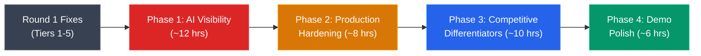
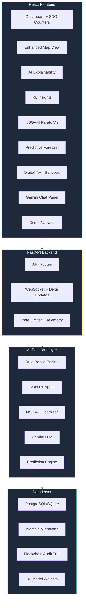

# SOLV — Round 2 Advanced Improvements Master Plan

> Post-Tier 1–5 Fixes: The "Wow Factor" Roadmap for Judges

This plan assumes all 30 items from your current improvement plan are **already complete**. Everything below is designed to differentiate SOLV from the competition — the kind of depth that makes judges say *"they actually built this?"*

---

## Executive Summary

Your current Round 1 codebase already has impressive bones: a **DQN reinforcement learning engine**, **NSGA-II multi-objective optimizer**, **multimodal graph search (Yen's k-shortest)**, **blockchain audit trail**, and a **predictive forecasting pipeline**. The problem? Most of these are underconnected — powerful engines running in isolation without visible impact.

This plan focuses on **three strategic pillars**:

1. **Make the AI visible** — Judges need to *see* the intelligence working
2. **Production hardening** — Show you understand real-world deployment
3. **Competitive differentiators** — Features that no other team will have



---

## Phase 1: 🔴 Make the AI Visible (~12 hrs)

> **Goal**: Every AI decision should be explainable, traceable, and visually compelling.

Judges can't evaluate what they can't see. Your RL engine, NSGA-II optimizer, and prediction engine are powerful — but currently buried behind generic API responses.

---

### 1.1 — AI Decision Explainability Dashboard

**Why**: Your `DecisionEngine.score_dispatch_options()` computes rich score breakdowns (overload risk, event severity, route risk) but the frontend never surfaces them. The `RecommendationsLogView` shows raw data but no visual explanation.

**What to build**:

#### [NEW] `frontend/src/components/views/AIExplainerView.jsx`
A dedicated "AI Brain" view that shows:
- **Decision Waterfall Chart**: For each active vehicle, show the scoring breakdown as a waterfall/funnel chart — `route_risk`, `overload_risk`, `event_severity`, `eta_penalty`, `port_pressure` → final action
- **Confidence Gauge**: Display `ai_confidence` from the RL engine vs rule-based engine, showing which engine "won" the decision
- **Counterfactual Panel**: "If the AI had chosen *continue* instead of *reroute_warehouse*, estimated delay would be +47 min, overflow risk +23%"
- **Decision History Timeline**: Scrollable timeline showing every AI decision with outcome (did the reroute actually save time?)

#### [MODIFY] [engine.py](file:///c:/Users/sam/Documents/Projects/sim-pro-max/modern%20ui/services/simulation/engine.py)
- Add `decision_trace` field to `LiveVehicleState` that stores the full score breakdown from the last dispatch decision
- Emit `decision_trace` events through the WebSocket alongside `simulation_snapshot`
- Track decision outcome: when a trip completes, compute `actual_savings_vs_predicted` and store it

#### [MODIFY] [decision_engine.py](file:///c:/Users/sam/Documents/Projects/sim-pro-max/modern%20ui/services/simulation/decision_engine.py)
- Return counterfactual analysis: for each non-chosen action, estimate what would have happened
- Add `explanation_text` generator that produces human-readable explanations like:
  *"Rerouted truck KA-01-1234 to Port Tuticorin because Chennai warehouse is at 94% capacity and cyclone pressure increases ETA by 1.3x"*

**Estimated effort**: 4 hrs

---

### 1.2 — RL Learning Curve Visualization

**Why**: You have a full DQN with replay buffer, target network, and epsilon-greedy exploration. But there's zero visibility into whether it's actually learning.

**What to build**:

#### [NEW] `frontend/src/components/views/RLInsightsView.jsx`
- **Epsilon Decay Curve**: Real-time chart showing epsilon declining from 1.0 → 0.05 as the agent learns
- **Reward Distribution**: Histogram of rewards per episode, grouped by action type
- **Q-Value Heatmap**: 10×5 heatmap showing Q-values for each state dimension × action
- **Policy Stability Indicator**: Show how often the RL agent overrides the rule-based engine, and success rate
- **Training Loss Plot**: Real-time loss curve from `train_step_update()`

#### [MODIFY] [rl_decision_engine.py](file:///c:/Users/sam/Documents/Projects/sim-pro-max/modern%20ui/services/rl_decision_engine.py)
- Add `get_training_stats()` method that returns epsilon, train_step, average reward, loss history
- Store per-episode reward history (ring buffer of last 500 episodes)
- Add `get_q_value_matrix(sample_states)` for heatmap generation

#### [NEW] `routes/rl.py`
- `GET /api/rl/stats` → training stats
- `GET /api/rl/q-values` → Q-value samples for visualization
- `POST /api/rl/reset` → reset the RL agent (useful for demo)

**Estimated effort**: 3 hrs

---

### 1.3 — NSGA-II Pareto Front Visualization

**Why**: Your NSGA-II optimizer computes Pareto-optimal solutions across 5 objectives. This is a *research-grade* feature that judges will love — if they can see it.

**What to build**:

#### [NEW] `frontend/src/components/views/OptimizerView.jsx`
- **Pareto Scatter Plot**: Interactive 2D projection of the Pareto front (user selects which 2 of 5 objectives to plot as axes)
- **Radar/Spider Chart**: For the selected compromise solution, show all 5 objectives vs the worst/best in the front
- **Trade-off Slider**: Let users adjust objective weights interactively and see how the "best compromise" shifts
- **Generation Animation**: Replay how the population evolved over NSGA-II generations (animate the scatter plot)

#### [MODIFY] [multi_objective_optimizer.py](file:///c:/Users/sam/Documents/Projects/sim-pro-max/modern%20ui/services/multi_objective_optimizer.py)
- Cache generation snapshots during `optimize()` for replay
- Return `ParetoFrontResult` with all individuals, not just top 10

**Estimated effort**: 3 hrs

---

### 1.4 — Gemini-Powered Natural Language Ops Assistant

**Why**: You already have `google-genai` in requirements and a `gemini_api_key` in config, plus routes in `routes/ai.py`. Extend this into a first-class conversational assistant.

**What to build**:

#### [MODIFY] [ai.py](file:///c:/Users/sam/Documents/Projects/sim-pro-max/modern%20ui/routes/ai.py)
- Add `POST /api/ai/chat` endpoint that accepts natural language queries
- System prompt includes current simulation state (vehicle statuses, active disruptions, metrics)
- Support queries like:
  - *"Why was truck KA-07 rerouted?"* → pulls from blockchain audit trail + decision trace
  - *"What's the risk outlook for Chennai routes?"* → aggregates weather + news maps
  - *"Compare AI performance vs baseline today"* → pulls from MetricsSnapshot history
  - *"Suggest optimal fleet scaling for next week"* → triggers NSGA-II with forecast data

#### [NEW] `frontend/src/components/common/AIChatPanel.jsx`
- Slide-out chat panel accessible from any view
- Streaming responses via SSE
- Context-aware: automatically includes current view's data in the prompt
- Suggested questions based on current simulation state

**Estimated effort**: 2 hrs

---

## Phase 2: 🟡 Production Hardening (~8 hrs)

> **Goal**: Demonstrate you understand what it takes to run this in the real world.

---

### 2.1 — Database Migration System

**Why**: You use `init_db()` which calls `Base.metadata.create_all()`. This works for demos but is a red flag for judges evaluating production readiness. Schema changes require dropping the database.

**What to build**:

#### [NEW] `alembic/` directory + migration config
- Set up Alembic with auto-generation from SQLAlchemy models
- Create initial migration from current schema
- Add migration runner to `build.sh`

#### [MODIFY] [database.py](file:///c:/Users/sam/Documents/Projects/sim-pro-max/modern%20ui/database.py)
- Replace `create_all()` with Alembic migration check on startup
- Add connection pooling configuration for production

**Estimated effort**: 2 hrs

---

### 2.2 — API Rate Limiting & Request Validation

**Why**: No rate limiting means a single client can DOS the simulation engine. No request validation means malformed input crashes the server silently.

**What to build**:

#### [NEW] `middleware/rate_limiter.py`
- Token bucket rate limiter: 100 req/min per IP for API, 10 req/min for AI endpoints
- Separate limits for WebSocket connections (max 50 concurrent)

#### [MODIFY] [main.py](file:///c:/Users/sam/Documents/Projects/sim-pro-max/modern%20ui/main.py)
- Add rate limiting middleware
- Add structured error responses (RFC 7807 problem details)
- Add request ID middleware for traceability

**Estimated effort**: 1.5 hrs

---

### 2.3 — Structured Logging with OpenTelemetry

**Why**: 95+ `print()` calls (you're already fixing these), but go further — add distributed tracing so you can see the full lifecycle of a simulation event.

**What to build**:

#### [NEW] `middleware/telemetry.py`
- OpenTelemetry integration with trace context propagation
- Structured JSON logging with correlation IDs
- Custom spans for: simulation tick, AI decision, route planning, event ingestion
- Export to console (dev) or OTLP endpoint (production)

#### [MODIFY] All service files
- Replace `print()` with structured logger that includes:
  - `simulation_time`, `vehicle_id`, `action`, `duration_ms`
  - Trace/span IDs for correlating across services

**Estimated effort**: 2.5 hrs

---

### 2.4 — PostgreSQL Support + Connection Pooling

**Why**: SQLite is great for demos but judges know it doesn't scale. Your `database_url` config already supports it — you just need to prove it works.

**What to build**:

#### [MODIFY] [database.py](file:///c:/Users/sam/Documents/Projects/sim-pro-max/modern%20ui/database.py)
- Add `asyncpg` driver support for async PostgreSQL
- Configure connection pool (min=2, max=10, overflow=5)
- Add `DATABASE_URL=postgresql://...` option to render.yaml

#### [MODIFY] `render.yaml`
- Add PostgreSQL database service
- Configure connection string as environment variable

**Estimated effort**: 2 hrs

---

## Phase 3: 🔵 Competitive Differentiators (~10 hrs)

> **Goal**: Features that put you in a different league from competitors.

---

### 3.1 — Predictive Disruption Forecasting with Gemini

**Why**: Your current disruption system is reactive — it ingests weather/news data that already happened. A predictive system that *forecasts* disruptions would be genuinely novel.

**What to build**:

#### [MODIFY] [predictive_forecast.py](file:///c:/Users/sam/Documents/Projects/sim-pro-max/modern%20ui/services/predictive_forecast.py)
- Implement time-series forecasting on `WeatherEvent` history:
  - Use exponential smoothing on precipitation/closure_risk trends
  - Detect cyclone season patterns (June-November for Bay of Bengal)
  - Generate 72-hour ahead disruption probability per city
- Feed Gemini with recent weather + news context for situational analysis

#### [NEW] `frontend/src/components/views/ForecastDashboardView.jsx`
Replace the existing empty [ForecastView.jsx](file:///c:/Users/sam/Documents/Projects/sim-pro-max/modern%20ui/frontend/src/components/views/ForecastView.jsx) with:
- **72-Hour Risk Heatmap**: Map overlay showing predicted disruption probability by city
- **Proactive Reroute Suggestions**: "Based on forecast, pre-position 3 trucks at Vizag warehouse before cyclone hits Chennai"
- **Historical Accuracy Tracker**: Show how past predictions compared to actual disruptions

**Estimated effort**: 3 hrs

---

### 3.2 — Multi-Modal Route Optimization with Live Comparison

**Why**: Your `MultimodalGraphEngine` supports road/rail/water with Yen's k-shortest paths, driver reliability penalties, and time windows. But the frontend doesn't expose this power.

**What to build**:

#### [NEW] `frontend/src/components/views/MultiModalRouteView.jsx`
- **Route Comparison Table**: Side-by-side comparison of road vs rail vs water vs multimodal routes
- **Interactive Map Overlay**: Draw all k routes on the map with color-coded transport modes
- **Business Metrics Panel**: Show fuel savings, CO2 reduction, time trade-offs from [RouteBusinessMetrics](file:///c:/Users/sam/Documents/Projects/sim-pro-max/modern%20ui/services/multimodal_graph_engine.py#L401-L419)
- **Drag-and-Drop Waypoints**: Let users add intermediate stops and see how routes adjust
- **Mode Switch Visualization**: Highlight where road→rail or rail→water transitions happen, with associated penalties

**Estimated effort**: 3 hrs

---

### 3.3 — Digital Twin: Scenario Sandbox

**Why**: Your `compare_scenario()` method runs baseline vs AI comparison, but it's a one-shot calculation. A true digital twin would let judges play "what-if" scenarios in real-time.

**What to build**:

#### [NEW] `services/simulation/sandbox.py`
- Fork the simulation engine state into an isolated sandbox
- Allow parameter tweaking without affecting the live simulation:
  - "What if we add 5 trucks to the fleet?"
  - "What if Mumbai port closes for 48 hours?"
  - "What if we switch all Mumbai→Chennai routes to rail?"
- Run sandbox 10x faster than live simulation
- Show side-by-side metrics comparison

#### [MODIFY] [ScenariosView.jsx](file:///c:/Users/sam/Documents/Projects/sim-pro-max/modern%20ui/frontend/src/components/views/ScenariosView.jsx)
- Add "Sandbox Mode" toggle
- Split-screen view: live simulation on left, sandbox on right
- Parameter adjustment panel with sliders for severity, fleet size, route preferences

**Estimated effort**: 4 hrs

---

## Phase 4: 🟢 Demo Day Polish (~6 hrs)

> **Goal**: Make the 5-minute demo unforgettable.

---

### 4.1 — Guided Demo Mode with Narration Points

**Why**: In a competition demo, you need the system to tell a story, not just show data.

**What to build**:

#### [NEW] `frontend/src/components/common/DemoNarrator.jsx`
- Floating "Demo Script" panel with step-by-step narration
- Auto-advance triggers:
  1. "Starting simulation..." → waits for first dispatch
  2. "Watch: cyclone detected in Chennai..." → waits for disruption event
  3. "AI rerouting 3 trucks to Tuticorin..." → highlights reroute decisions
  4. "Compared to baseline: 23% fewer delays, 340kg CO2 saved" → shows scenario comparison
  5. "RL agent has learned from 1,200 decisions..." → shows RL insights
- Hotkeys for quick navigation between demo points

**Estimated effort**: 2 hrs

---

### 4.2 — Real-Time SDG Impact Counter

**Why**: You track SDG metrics (stockouts prevented, critical deliveries saved, beneficiary locations served) but they're buried in the metrics object. For a competition about essential goods, these should be front and center.

**What to build**:

#### [MODIFY] [DashboardView.jsx](file:///c:/Users/sam/Documents/Projects/sim-pro-max/modern%20ui/frontend/src/components/views/DashboardView.jsx)
- Add animated SDG impact strip at the top:
  - 🏥 **14 stockouts prevented** (counter animates up)
  - 🚚 **892 critical deliveries completed** 
  - 📍 **67 beneficiary locations served**
  - 🌱 **2,340 kg CO₂ saved** (with tree equivalent)
  - 💰 **₹4.7L operational costs saved**
- Each counter links to a detail drill-down showing which specific decisions contributed

**Estimated effort**: 1.5 hrs

---

### 4.3 — Map Enhancements

**Why**: Your [MapView.jsx](file:///c:/Users/sam/Documents/Projects/sim-pro-max/modern%20ui/frontend/src/components/views/MapView.jsx) is already 29KB — impressive. But for demo day, these additions make it *memorable*.

**What to build**:

#### [MODIFY] `MapView.jsx`
- **Animated truck markers** that move along routes in real-time (interpolate position from progress_pct)
- **Disruption heat overlay**: Red/orange zones over cities with active weather/news events
- **Route glow effect**: AI-rerouted routes glow green, baseline routes are gray
- **Click-on-truck**: Popup showing full decision trace, current objective, ETA, AI confidence
- **Cascade ripple animation**: When cascade detection triggers, show expanding ripple from the overloaded facility

**Estimated effort**: 2.5 hrs

---

## Phase 5: ⚡ Performance & Scalability (Bonus, ~4 hrs)

> If time permits — these show engineering maturity.

---

### 5.1 — WebSocket Message Batching

**Why**: Currently, every simulation tick broadcasts a full `dashboard_snapshot` to all connected clients. With 86 facilities and 12 vehicles, that's a lot of JSON per tick.

#### [MODIFY] [connection_manager.py](file:///c:/Users/sam/Documents/Projects/sim-pro-max/modern%20ui/services/simulation/connection_manager.py)
- Implement delta-only updates: only send changed fields
- Batch broadcast to max 1 update per 500ms
- Add message compression (gzip)

**Estimated effort**: 1.5 hrs

---

### 5.2 — Background Event Ingestion with Async Workers

**Why**: Event ingestion (weather/news from Excel) runs synchronously on startup, blocking the server for seconds. If workbooks grow, this becomes untenable.

#### [MODIFY] [event_ingestion.py](file:///c:/Users/sam/Documents/Projects/sim-pro-max/modern%20ui/services/event_ingestion.py)
- Move workbook parsing to background tasks using `asyncio.to_thread()`
- Add progress reporting via WebSocket
- Implement incremental ingestion (only new rows since last import)

**Estimated effort**: 1.5 hrs

---

### 5.3 — Simulation State Persistence & Resume

**Why**: If the server restarts, the simulation resets. For a production system, you should be able to resume.

#### [NEW] `services/simulation/state_persistence.py`
- Serialize `SimulationEngine` state to JSON periodically (every 50 ticks)
- On startup, detect persisted state and offer to resume
- Add `POST /api/simulation/save` and `POST /api/simulation/load` endpoints

**Estimated effort**: 1 hr

---

## Priority Matrix

| Phase | Item | Judge Impact | Effort | ROI |
|-------|------|-------------|--------|-----|
| 1 | AI Explainability Dashboard | 🔥🔥🔥🔥🔥 | 4 hrs | **Critical** |
| 1 | Gemini Chat Assistant | 🔥🔥🔥🔥🔥 | 2 hrs | **Critical** |
| 4 | SDG Impact Counter | 🔥🔥🔥🔥🔥 | 1.5 hrs | **Critical** |
| 4 | Map Enhancements | 🔥🔥🔥🔥 | 2.5 hrs | **Very High** |
| 1 | RL Learning Curve Viz | 🔥🔥🔥🔥 | 3 hrs | **Very High** |
| 3 | Predictive Forecasting | 🔥🔥🔥🔥 | 3 hrs | **Very High** |
| 4 | Demo Narrator | 🔥🔥🔥🔥 | 2 hrs | **High** |
| 3 | Digital Twin Sandbox | 🔥🔥🔥🔥 | 4 hrs | **High** |
| 1 | NSGA-II Pareto Viz | 🔥🔥🔥 | 3 hrs | **High** |
| 3 | Multi-Modal Route View | 🔥🔥🔥 | 3 hrs | **High** |
| 2 | Alembic Migrations | 🔥🔥🔥 | 2 hrs | **Medium** |
| 2 | Structured Logging | 🔥🔥 | 2.5 hrs | **Medium** |
| 2 | Rate Limiting | 🔥🔥 | 1.5 hrs | **Medium** |
| 2 | PostgreSQL Support | 🔥🔥 | 2 hrs | **Medium** |
| 5 | WS Message Batching | 🔥 | 1.5 hrs | **Low** |
| 5 | Async Event Ingestion | 🔥 | 1.5 hrs | **Low** |
| 5 | State Persistence | 🔥 | 1 hr | **Low** |

---

## Recommended Execution Order

If you have **limited time**, do these in order:

```
 1. SDG Impact Counter (1.5 hrs)         ← Instant visual win
 2. AI Explainability Dashboard (4 hrs)  ← Shows the AI is real
 3. Gemini Chat Assistant (2 hrs)        ← Wow factor, uses existing infra
 4. Map Enhancements (2.5 hrs)           ← Makes the demo memorable
 5. Demo Narrator (2 hrs)                ← Controls the demo story
 6. RL Learning Curve Viz (3 hrs)        ← Proves ML is working
 7. Predictive Forecasting (3 hrs)       ← Novel differentiator
```

Total for top 7: **~18 hrs** — achievable in a focused 2–3 day sprint.

---

## Architecture After Improvements



---

## Open Questions

> [!IMPORTANT]
> **Competition Format**: How long is the Round 2 demo? If it's 5 minutes, the Demo Narrator and SDG Counter are essential. If it's 15+ minutes, you can show deeper technical features like the RL insights and NSGA-II visualization.

> [!IMPORTANT]
> **Judging Criteria**: Do the judges weigh innovation vs. production-readiness vs. impact? This affects whether we prioritize Phase 1 (AI visibility) vs Phase 2 (production hardening) vs Phase 4 (SDG impact).

> [!NOTE]
> **Existing 167MB SQLite database**: Your `supply_chain.db` is 167MB. If you add PostgreSQL support, do you want to migrate existing data or start fresh with demo seed data?

> [!NOTE]
> **Driver App**: You have a separate `driver-app-main/` directory. Should any of these improvements extend to the driver mobile experience?
