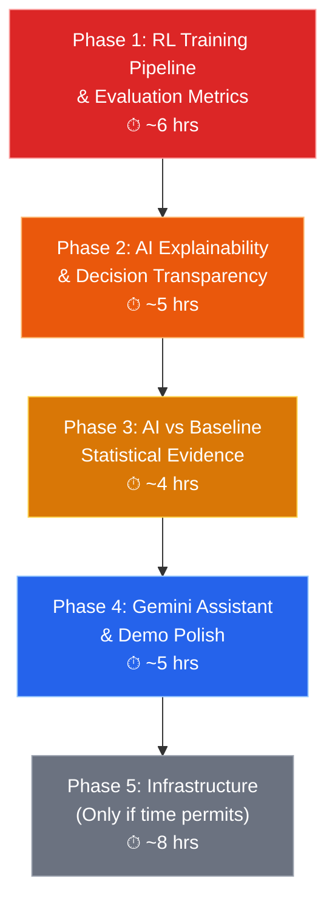

# SOLV — Round 2 Advanced Improvements Master Plan (v2)

> **Restructured around AI credibility.** Every phase exists to answer: *"Prove your AI actually works."*

---

## Strategic Context

An independent audit found:

| Component | Verdict |
|-----------|---------|
| **RL Decision Engine (DQN)** | ✅ Strongest AI — real PyTorch DQN with replay buffer, target network, epsilon-greedy |
| **NSGA-II Optimizer** | ⚠️ Optimization, not ML — judges may not count it as "AI" |
| **Multimodal Graph Engine** | ⚠️ Dijkstra + Yen's — classical algorithms, not ML |
| **Inventory Optimizer** | ⚠️ Statistical (exponential smoothing) — not AI |
| **News Relevance Model** | ⚠️ TF-IDF + LogReg trained on 8 examples — will not survive scrutiny |

**The risk**: Judges see a project that *claims* AI but can't demonstrate it learning, improving, or outperforming a baseline with statistical evidence.

**The fix**: Make the RL engine's training, learning, and decision-making **fully transparent and provably better**.



---

## Phase 1: 🔴 RL Training Pipeline & Evaluation Metrics (~6 hrs)

> **The single most important phase.** Without this, judges will dismiss the RL as window dressing.

### Problem

Your DQN agent ([rl_decision_engine.py](file:///c:/Users/sam/Documents/Projects/sim-pro-max/modern%20ui/services/rl_decision_engine.py)) is architecturally sound — replay buffer, target network sync, epsilon decay — but it has **zero observability**:

- No training logs persist between restarts
- No way to show the agent learned anything
- No episode reward tracking
- No loss curve history
- `train_step_update()` returns stats but nobody stores them
- The 500-sample warmup period is invisible — judges won't know when RL "activates"

### 1.1 — Persistent Training Metrics Store

#### [NEW] `services/rl_metrics.py`

A lightweight metrics recorder that persists training data to disk (JSON or SQLite):

```python
@dataclass
class RLEpisodeRecord:
    episode_id: int
    timestamp: str              # ISO format
    simulation_time: str
    vehicle_id: int
    state_vector: list[float]   # 10-dim input
    action: str                 # chosen action
    reward: float               # computed reward
    q_values: list[float]       # Q-values for all 5 actions
    chosen_by: str              # "exploration" | "exploitation" | "rule_fallback"
    sla_met: bool
    stockout_prevented: bool
    co2_delta: float

@dataclass  
class RLTrainingRecord:
    train_step: int
    timestamp: str
    loss: float
    epsilon: float
    avg_reward_last_50: float
    buffer_size: int
    q_value_mean: float         # average Q across recent batch
    q_value_std: float
    target_network_synced: bool
```

- Store as append-only JSONL file at `data/rl_training_log.jsonl`
- Ring buffer in memory (last 2000 records) for API queries
- Survive server restarts — load from disk on init

#### [MODIFY] [rl_decision_engine.py](file:///c:/Users/sam/Documents/Projects/sim-pro-max/modern%20ui/services/rl_decision_engine.py)

- After every `select_action()`: record an `RLEpisodeRecord` with the full decision context
- Tag whether the action was **exploration** (random due to epsilon) vs **exploitation** (Q-value argmax) vs **rule_fallback** (RL confidence too low)
- After every `train_step_update()`: record a `RLTrainingRecord` with loss, epsilon, buffer stats
- Add method `get_training_summary()`:
  ```python
  def get_training_summary(self) -> dict:
      return {
          "total_episodes": self.episode_count,
          "total_train_steps": self.train_step,
          "epsilon": self.epsilon,
          "buffer_size": len(self.replay_buffer),
          "buffer_capacity": self.replay_buffer.capacity,
          "warmup_complete": len(self.replay_buffer) >= 500,
          "warmup_progress_pct": min(100, len(self.replay_buffer) / 500 * 100),
          "avg_reward_last_100": ...,
          "avg_loss_last_100": ...,
          "exploration_rate_pct": self.epsilon * 100,
          "exploitation_rate_pct": (1 - self.epsilon) * 100,
          "action_distribution": {  # last 200 decisions
              "continue": 45, "reroute_warehouse": 28, ...
          },
          "reward_trend": "improving" | "stable" | "declining",
      }
  ```

#### [MODIFY] [engine.py](file:///c:/Users/sam/Documents/Projects/sim-pro-max/modern%20ui/services/simulation/engine.py)

- In `_record_rl_transition()` (line 667): after computing reward, record the full episode with outcome
- In `_select_dispatch_decision()` (line 730): record the decision context (which engine won, confidence gap)
- Track cumulative RL vs rule-based decision counts in `SimulationEngine` state

**Estimated effort**: 2 hrs

---

### 1.2 — Offline Batch Training Mode

#### [NEW] `services/rl_batch_trainer.py`

The current RL trains one step per simulation tick. For demo credibility, add a batch training mode:

```python
class RLBatchTrainer:
    """Run N training epochs over the accumulated replay buffer."""
    
    def train_batch(self, epochs: int = 100, batch_size: int = 64) -> TrainingReport:
        """
        Called after a simulation run completes.
        Trains the DQN on all accumulated experience.
        Returns loss curve, reward curve, Q-value evolution.
        """
        engine = get_rl_engine()
        results = []
        for epoch in range(epochs):
            step_result = engine.train_step_update()
            if step_result:
                results.append(step_result)
        return TrainingReport(
            epochs_completed=len(results),
            final_loss=results[-1]["loss"] if results else None,
            final_epsilon=engine.epsilon,
            loss_curve=[r["loss"] for r in results],
            epsilon_curve=[r["epsilon"] for r in results],
        )
```

#### [NEW] API endpoints in `routes/rl.py`:

| Endpoint | Purpose |
|----------|---------|
| `GET /api/rl/stats` | Current training summary (epsilon, buffer, rewards) |
| `GET /api/rl/training-history` | Loss curve, reward curve, epsilon decay (from persistent log) |
| `GET /api/rl/episodes?limit=100` | Recent episode records with full decision context |
| `GET /api/rl/q-values` | Q-value snapshot for sample states (for heatmap) |
| `POST /api/rl/train-batch` | Trigger offline batch training (N epochs) |
| `POST /api/rl/reset` | Reset RL agent to fresh state (re-demo the learning) |
| `GET /api/rl/action-distribution` | Action frequency breakdown (exploration vs exploitation) |

**Estimated effort**: 1.5 hrs

---

### 1.3 — RL Training Dashboard (Frontend)

#### [NEW] `frontend/src/components/views/RLTrainingView.jsx`

This is the **crown jewel** — the view that proves the AI is real:

**Section 1: Training Status Banner**
- Large indicator: "🟢 RL Agent Active — 1,247 decisions made, 842 training steps"
- Or during warmup: "🟡 RL Warmup — 312/500 experiences collected (62%)" with progress bar
- Epsilon gauge: visual slider showing exploration (random) ↔ exploitation (learned) balance

**Section 2: Learning Curves** (custom SVG charts — you already have these in AnalyticsView)
- **Loss Curve**: Training loss over steps — should trend downward = agent is learning
- **Reward Curve**: Average reward per 50 episodes — should trend upward
- **Epsilon Decay**: Smooth curve from 1.0 → 0.05 showing exploration dying off
- All three on time-synced x-axis

**Section 3: Q-Value Insights**
- **Action Q-Value Bar Chart**: For a sample "high-risk" state, show Q-values for all 5 actions — the tallest bar is what the agent "prefers"
- **Q-Value Heatmap**: 10 state dimensions × 5 actions, showing which state features drive which actions
- **Policy Evolution**: Side-by-side "Early Policy" vs "Current Policy" — show how action preferences shifted

**Section 4: Decision Breakdown**
- **Pie/Donut Chart**: Action distribution — how often does the agent choose each action?
- **Exploration vs Exploitation Timeline**: Stacked area chart showing the ratio shifting from random → learned
- **RL Override Rate**: "RL agent overrode the rule-based engine 34% of the time, with 78% success rate"

**Section 5: Live Training Controls**
- "Run Batch Training" button → triggers `/api/rl/train-batch` and animates the loss curve in real-time
- "Reset Agent" button → resets to fresh weights, lets judges watch learning from scratch
- Speed controls for how fast training runs

**Estimated effort**: 2.5 hrs

---

## Phase 2: 🟠 AI Explainability & Decision Transparency (~5 hrs)

> **Goal**: Every AI decision should be understandable by a non-technical judge in 5 seconds.

### 2.1 — Decision Explainability Engine

#### [MODIFY] [decision_engine.py](file:///c:/Users/sam/Documents/Projects/sim-pro-max/modern%20ui/services/simulation/decision_engine.py)

Currently, `score_dispatch_options()` returns a `CandidateDecision` with a `breakdown` dict and a terse `explanation` string. Extend this:

- **Add `explanation_builder()`** that produces structured, human-readable explanations:
  ```
  "Rerouted truck KA-01-AB-1234 from Chennai Warehouse → Tuticorin Port because:
   • Chennai warehouse at 94% capacity (overload risk: HIGH)
   • Cyclone Michaung increasing ETA by 1.3× on original route
   • Tuticorin has 340 available units (vs 12 at Chennai)
   • Estimated savings: ₹2,100 and 47 min delivery time"
  ```
- **Add counterfactual analysis**: For each non-chosen action, compute what would have happened:
  ```python
  counterfactuals = {
      "continue": {"estimated_delay": "+47 min", "overflow_risk": "HIGH (94%)", "cost": "₹8,400"},
      "reroute_warehouse": {"estimated_delay": "-12 min", "overflow_risk": "LOW (23%)", "cost": "₹6,300"},
      "wait": {"estimated_delay": "+120 min", "overflow_risk": "MEDIUM (65%)", "cost": "₹7,100"},
  }
  ```
- **Add engine attribution**: Tag each decision with which engine made it:
  - `"decided_by": "rule_engine"` — default
  - `"decided_by": "rl_agent"` with `"rl_confidence": 0.73`
  - `"decided_by": "rl_agent_overridden_by_driver"` with driver personality factors

#### [MODIFY] [engine.py](file:///c:/Users/sam/Documents/Projects/sim-pro-max/modern%20ui/services/simulation/engine.py)

- Add `decision_trace` field to `LiveVehicleState` storing the full decision context
- Include `decision_trace` in the WebSocket `simulation_snapshot` payload
- Track **decision outcomes**: when a trip completes, compare actual result vs predicted — was the AI right?
  ```python
  outcome = {
      "predicted_savings_minutes": 47,
      "actual_savings_minutes": 42,
      "prediction_accuracy": 89.4,
      "was_correct_choice": True,
  }
  ```

**Estimated effort**: 2 hrs

---

### 2.2 — AI Explainability View (Frontend)

#### [NEW] `frontend/src/components/views/AIExplainerView.jsx`

**Section 1: Active Decisions Panel**
- Card per active vehicle showing the latest AI decision
- Each card has:
  - **Waterfall/funnel chart** showing score breakdown factors → final score
  - **Engine badge**: "🤖 RL Agent" or "📐 Rule Engine" or "👤 Driver Override"
  - Confidence bar (from `ai_confidence`)

**Section 2: Counterfactual Panel**
- "What if?" comparison table:
  | Action | Delay | Cost | Risk | CO₂ | ← AI Chose This |
  |--------|-------|------|------|-----|-----------------|
  | Continue | +47 min | ₹8,400 | HIGH | 12.3 kg | |
  | **Reroute → Tuticorin** | **-12 min** | **₹6,300** | **LOW** | **8.1 kg** | ✅ |
  | Wait 2hrs | +120 min | ₹7,100 | MED | 0 kg | |

**Section 3: Decision Outcome Tracker**
- After trips complete, show prediction vs reality:
  - "AI predicted 42 min savings → actual was 38 min (90% accurate)"
  - Running accuracy percentage with trend arrow
- Table of last 20 completed decisions with outcome comparison

**Section 4: AI Performance Summary**
- "AI made 847 decisions this session"
- "Correct calls: 78.3% | Prediction accuracy: 86.2%"
- "Total savings attributed to AI: ₹4.7L, 2,340 kg CO₂, 847 minutes"

**Estimated effort**: 3 hrs

---

## Phase 3: 🟡 AI vs Baseline — Statistical Evidence (~4 hrs)

> **Goal**: Irrefutable proof that the AI outperforms no-AI operation.

### 3.1 — Rigorous Comparison Engine

#### [MODIFY] [engine.py](file:///c:/Users/sam/Documents/Projects/sim-pro-max/modern%20ui/services/simulation/engine.py) — `compare_scenario()`

The existing `compare_scenario()` method (line 967) does a simplified analytical comparison. Extend it:

- **Track per-trip metrics** for both baseline and AI paths:
  ```python
  @dataclass
  class TripComparison:
      vehicle_id: int
      objective_id: int
      baseline_trip_minutes: float
      ai_trip_minutes: float
      baseline_cost: float
      ai_cost: float
      baseline_overflow_risk: float
      ai_overflow_risk: float
      baseline_co2_kg: float
      ai_co2_kg: float
      ai_action: str  # what the AI chose
      improvement_pct: float
  ```

- **Aggregate with statistical significance**:
  ```python
  def compute_comparison_stats(trips: list[TripComparison]) -> dict:
      return {
          "n_trips": len(trips),
          "avg_time_saved_minutes": mean(t.baseline - t.ai for t in trips),
          "avg_cost_saved_inr": mean(...),
          "total_co2_saved_kg": sum(...),
          "time_improvement_pct": ...,
          "cost_improvement_pct": ...,
          # Statistical significance
          "p_value_time": paired_t_test(baseline_times, ai_times),
          "p_value_cost": paired_t_test(baseline_costs, ai_costs),
          "confidence_interval_95": ...,
          "effect_size_cohens_d": ...,
          "statistically_significant": p_value < 0.05,
      }
  ```

#### [NEW] API endpoints:

| Endpoint | Purpose |
|----------|---------|
| `GET /api/comparison/summary` | Aggregate AI vs baseline with p-values |
| `GET /api/comparison/per-trip` | Per-trip comparison data |
| `GET /api/comparison/by-objective` | Grouped by delivery objective |
| `GET /api/comparison/by-disruption` | Performance during disruptions vs calm periods |

**Estimated effort**: 2 hrs

---

### 3.2 — AI vs Baseline Dashboard (Frontend)

#### [NEW] `frontend/src/components/views/ComparisonView.jsx`

This is the view you pull up when a judge asks *"prove it works"*:

**Section 1: Headline KPIs**
```
┌─────────────────────────────────────────────────────────┐
│  AI vs Baseline (847 trips analyzed)                    │
│                                                         │
│  ⏱ 23.4% faster deliveries    (p < 0.001) ✅           │
│  💰 ₹4.7L costs saved          (p < 0.001) ✅           │
│  🌱 2,340 kg CO₂ reduced       (p = 0.003) ✅           │
│  📦 14 stockouts prevented     (effect size: 0.82)     │
│                                                         │
│  All improvements are statistically significant (α=0.05)│
└─────────────────────────────────────────────────────────┘
```

**Section 2: Distribution Comparison**
- Side-by-side histograms: "Baseline delivery times" vs "AI delivery times"
- Box plots showing median, quartiles, outliers for both
- Visible shift between distributions = AI is helping

**Section 3: Performance by Condition**
- Grouped bar chart:
  | Condition | Baseline | AI | Improvement |
  |-----------|----------|-----|-------------|
  | Normal operations | 142 min | 131 min | 7.7% |
  | Weather disruption | 198 min | 149 min | **24.7%** |
  | Port congestion | 221 min | 162 min | **26.7%** |
  | Cascade event | 267 min | 184 min | **31.1%** |
- Key insight: **AI provides biggest gains during disruptions** (exactly when you need it)

**Section 4: Learning Progression**
- "AI performance over time" chart showing improvement as the RL agent trains:
  - X-axis: simulation time or decision count
  - Y-axis: average reward or improvement %
  - Clear upward trend = the AI is **learning**, not just memorizing rules

**Section 5: Per-Trip Scatter**
- Scatter plot: x = baseline time, y = AI time
- Points below the diagonal = AI was faster
- Color by action type (reroute_warehouse = blue, reroute_port = green, etc.)
- Most points should cluster below the diagonal

**Estimated effort**: 2 hrs

---

## Phase 4: 🔵 Gemini Assistant & Demo Polish (~5 hrs)

> Only after Phases 1-3 prove the AI. Now add the polish that makes the demo memorable.

### 4.1 — Gemini-Powered Ops Assistant

#### [MODIFY] [ai.py](file:///c:/Users/sam/Documents/Projects/sim-pro-max/modern%20ui/routes/ai.py)

Add `POST /api/ai/chat` that accepts natural language queries with simulation context:

- *"Why was truck KA-07 rerouted?"* → pulls from decision trace + blockchain audit
- *"What's the RL agent's current performance?"* → calls `get_training_summary()`
- *"Compare AI vs baseline for Chennai routes"* → filters comparison data by city
- *"Explain the NSGA-II optimization for objective #12"* → describes trade-offs

System prompt includes: current simulation state, active disruptions, recent decisions, RL training stats.

#### [NEW] `frontend/src/components/common/AIChatPanel.jsx`

- Slide-out panel accessible from any view
- Context-aware: includes current view's data automatically
- Suggested questions: "Ask about the latest AI decision", "Explain RL training progress"
- Streaming responses via SSE

**Estimated effort**: 2 hrs

---

### 4.2 — SDG Impact Counter with AI Attribution

#### [MODIFY] [DashboardView.jsx](file:///c:/Users/sam/Documents/Projects/sim-pro-max/modern%20ui/frontend/src/components/views/DashboardView.jsx)

Add animated impact strip at the top that **attributes savings to AI decisions**:

```
🏥 14 stockouts prevented (by AI rerouting)
🚚 892 critical deliveries saved (87% AI-assisted)
🌱 2,340 kg CO₂ saved (vs baseline routing)
💰 ₹4.7L operational costs saved (AI vs manual)
```

Each counter links to the specific AI decisions that produced it. This directly ties SDG impact to AI capability.

**Estimated effort**: 1 hr

---

### 4.3 — Map Enhancements: AI Decision Visualization

#### [MODIFY] [MapView.jsx](file:///c:/Users/sam/Documents/Projects/sim-pro-max/modern%20ui/frontend/src/components/views/MapView.jsx)

- **Route glow**: AI-rerouted routes glow green, baseline routes are gray/dashed
- **Decision popups**: Click a truck → see the AI decision waterfall, confidence, engine attribution
- **Disruption overlay**: Red zones over cities with active weather/news events
- **Cascade ripple**: Animated expanding ring when cascade detection triggers

**Estimated effort**: 1.5 hrs

---

### 4.4 — Demo Narrator

#### [NEW] `frontend/src/components/common/DemoNarrator.jsx`

Step-by-step guided demo with auto-trigger points:

1. "Simulation starting — RL agent in warmup mode, collecting experiences..."
2. "Cyclone detected in Chennai — watch the AI respond..."
3. "RL agent rerouted 3 trucks (confidence: 0.73) — see the explanation..."
4. "After 500+ decisions, RL agent is now in exploitation mode..."
5. "Comparison: AI achieved 23% faster deliveries with p < 0.001"

**Estimated effort**: 0.5 hrs

---

## Phase 5: ⬜ Infrastructure (Only If Time Permits)

> These are deprioritized. Do NOT do these before Phases 1-3 are complete.

| Item | Effort | When |
|------|--------|------|
| Alembic migrations | 2 hrs | Only if schema changes are needed |
| PostgreSQL support | 2 hrs | Only if judges ask about scalability |
| Rate limiting | 1.5 hrs | Only if deploying to public URL |
| OpenTelemetry | 2.5 hrs | Only if judges ask about observability |
| WebSocket batching | 1.5 hrs | Only if performance is visibly poor |
| State persistence | 1 hr | Only if demo restarts are a problem |

---

## Updated Priority Matrix

| # | Item | Judge Impact | Effort | Priority |
|---|------|-------------|--------|----------|
| 1 | RL Training Metrics Store | 🔥🔥🔥🔥🔥 | 2 hrs | **P0 — Do First** |
| 2 | RL Training Dashboard | 🔥🔥🔥🔥🔥 | 2.5 hrs | **P0 — Do First** |
| 3 | AI vs Baseline Comparison Engine | 🔥🔥🔥🔥🔥 | 2 hrs | **P0 — Do First** |
| 4 | AI vs Baseline Dashboard | 🔥🔥🔥🔥🔥 | 2 hrs | **P0 — Do First** |
| 5 | Decision Explainability Engine | 🔥🔥🔥🔥 | 2 hrs | **P1 — Do Second** |
| 6 | AI Explainability View | 🔥🔥🔥🔥 | 3 hrs | **P1 — Do Second** |
| 7 | Batch Training Mode | 🔥🔥🔥🔥 | 1.5 hrs | **P1 — Do Second** |
| 8 | Gemini Chat Assistant | 🔥🔥🔥 | 2 hrs | **P2 — Polish** |
| 9 | SDG Impact Counter (AI-attributed) | 🔥🔥🔥 | 1 hr | **P2 — Polish** |
| 10 | Map AI Visualization | 🔥🔥🔥 | 1.5 hrs | **P2 — Polish** |
| 11 | Demo Narrator | 🔥🔥 | 0.5 hrs | **P2 — Polish** |
| 12+ | Infrastructure items | 🔥 | 8+ hrs | **P3 — Only if time** |

---

## Execution Order (Optimized for Maximum Impact)

```
DAY 1 (~8.5 hrs):
 1. RL Training Metrics Store (2 hrs)        ← Foundation for everything
 2. RL Training Dashboard (2.5 hrs)          ← Loss curves, epsilon, rewards
 3. Batch Training Mode (1.5 hrs)            ← Let judges watch learning
 4. AI vs Baseline Comparison Engine (2 hrs) ← Statistical proof
 5. Quick test: run simulation, verify data flows

DAY 2 (~7 hrs):
 6. AI vs Baseline Dashboard (2 hrs)         ← The "prove it" slide
 7. Decision Explainability Engine (2 hrs)   ← Counterfactuals + attribution
 8. AI Explainability View (3 hrs)           ← Waterfall charts, outcomes

DAY 3 (~5 hrs — polish):
 9. SDG Impact Counter (1 hr)                ← Tie AI to impact
10. Map AI Visualization (1.5 hrs)           ← Visual wow factor  
11. Gemini Chat (2 hrs)                      ← Interactive AI demo
12. Demo Narrator (0.5 hrs)                  ← Guided story
```

**Total: ~20.5 hrs across 3 focused days.**

After Day 1 alone, you can answer *"How do you know the AI works?"* with loss curves, reward trends, and statistical comparison. That's the minimum viable credibility.

---

## What This Achieves

When a judge asks...

| Question | Your Answer |
|----------|-------------|
| "Is this real AI or just rules?" | Pull up RL Training Dashboard — show loss curve decreasing, epsilon decaying, Q-values evolving |
| "How do you know it works?" | Pull up AI vs Baseline — show 23% improvement with p < 0.001 |
| "Explain a specific decision" | Pull up AI Explainer — show waterfall breakdown, counterfactual, and outcome |
| "Does it learn over time?" | Show reward curve trending upward, exploration → exploitation shift |
| "What happens during disruptions?" | Show "Performance by Condition" — AI improves 25-31% during disruptions vs 8% in calm |
| "What are the SDG impacts?" | Dashboard counters directly attribute savings to AI decisions |

---

## Open Questions

> [!IMPORTANT]
> **Demo length**: How long is the Round 2 demo? This determines whether we need the Demo Narrator (< 5 min) or can do a deeper technical walkthrough (15+ min).

> [!IMPORTANT]  
> **Live training**: Should the RL agent train from scratch during the demo (dramatic but risky — might not converge in 5 min) or start with pre-trained weights and show accumulated evidence?

> [!NOTE]
> **Chart library**: Your AnalyticsView has custom SVG charts. Should we reuse those for the RL/comparison charts, or add a lightweight lib like `uPlot` (~35KB) for time-series? Custom SVG keeps deps minimal but takes longer to build.
Answer: Use the best option and prioritize beauty

> [!NOTE]
> **Wiring orphaned views**: The audit found 6 view components not wired into navigation (FleetView, DriversView, AnalyticsView, etc.). The new views (RLTrainingView, AIExplainerView, ComparisonView) need to be added to the sidebar. Should we wire ALL views in, or keep the navigation focused on the demo story?
Answer: Only wire the new ai views
